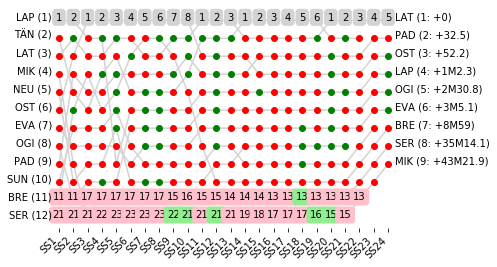

# Rally Report - Australia

*This report is unofficial and is not associated in any way with the Fédération Internationale de l’Automobile (FIA) or WRC Promoter GmbH.*

Kennards Hire Rally Australia (2018-11-15 to 2018-11-18) runs over 24 competitive special stages. The distance covered on the special stages is 318.64km, with an overall rally distance of 1017.07km. The special stage surface type is predominantly Gravel.

